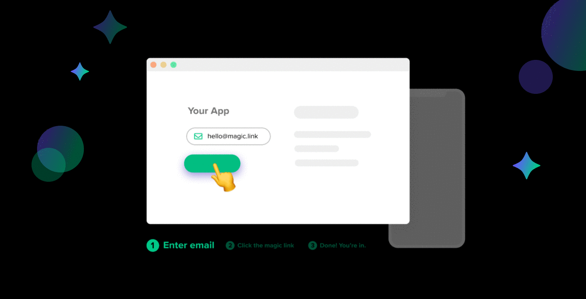
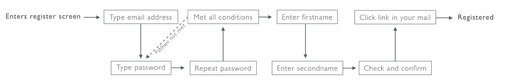

# 🎩 Welcome

## ✨ What is Magic?

**Magic** is a developer SDK which you can integrate into your application to enable **passwordless** authentication using **magic links** - similar to Slack and Medium.

When users want to sign up or log in to your application:

1. User requests a **magic link** sent to their email address
2. User clicks on that magic link
3. User is securely logged into the application

If it's a web application, users are logged into the _original_ tab, even if the user clicked on the magic link on a different browser or mobile device!

With Magic SDK, you can enable blazing-fast, hardware-secured, passwordless login with a few lines of code. It is also plug-n-playable even if you already have an existing auth solution!

#### Can't wait to try it out? 🔥Jump straight to our Get Started tutorial!



_Currently Magic only supports web-based application, and coming very soon to mobile platforms._

## 🤔 Why Passwordless?

### 💪 Upgrade Security

Properly managing user credentials, passwords, secrets, or sessions require tremendous amount of resources. Poor passwords actually account for 81% of all security breaches, since over 59% of people reuse their passwords _everywhere_ \[[Source](https://enterprise.verizon.com/resources/reports/2017_dbir.pdf)\]. This will cost companies up to $240,000 for every 1,000 records compromised \[[Source](https://digitalguardian.com/blog/whats-cost-data-breach-2019)\] - increasing risk and liability for your company. 

Type your email in [HaveIBeenPwned](https://haveibeenpwned.com/) and realize that your sensitive data and passwords have likely been compromised in many high profile breaches impacting companies like Equifax, Dropbox, Adobe, Kickstarter, LinkedIn, Tumblr, and so many more.

Worldwide spending on cybersecurity is projected to reach $133.7 billion in 2022 \[[Gartner](https://www.gartner.com/en/newsroom/press-releases/2018-08-15-gartner-forecasts-worldwide-information-security-spending-to-exceed-124-billion-in-2019)\], and the average cost of a breach has skyrocketed to around $3.92 million as of 2019 \[[Security Intelligence](https://securityintelligence.com/posts/whats-new-in-the-2019-cost-of-a-data-breach-report/)\]. Even though Equifax was breached in 2017, the company is still paying off the $4 billion damages in total.

🛡️ [Read more about our security](security.md)

### 💰 Reduce Overhead

Users tend to set passwords that are easy to crack, yet hard to remember, and account recovery support can be costly. **50% of all support tickets** are related to lost and forgotten passwords. Handling 10 tickets daily will cost your organization around **$128,000 annually**! 💸\[[Source](https://www.okta.com/blog/2019/08/how-much-are-password-resets-costing-your-company/)\]

In addition, Magic leverages blockchain-based, standardized public-private key cryptography to achieve identity management. When a new user signs up to your service, a public-private key pair is generated for them. Private keys are used to sign cryptographic proofs of a user's identity, which means in order to authenticate requests, your resource server will no longer need to store and manage \(1\) hashed+salted password or \(2\) user sessions in their user database table - making user tables super clean and lightweight. In applications that heavily focus on privacy,  they can still work even without user tables!

### 🚀 **Boost Conversion**

Passwords are a major source of on-boarding and conversion funnel friction.

We can clearly see removing passwords reduces the number of login/signup steps by over 66%. This has the potential to **increase conversion rates by 54%** reported by eCommerce websites \[[Source](https://www.cio.com/article/3193206/ditching-passwords-and-increasing-ecommerce-conversion-rates-by-54.html)\].

Passwordless is the future of online security. By delegating authentication to a user's email, mobile, or hardware device, they no longer have to wrestle with remembering passwords for the ever-increasing number of services that they interact with.

#### That's enough of an explanation. It's time to get started! 💫



