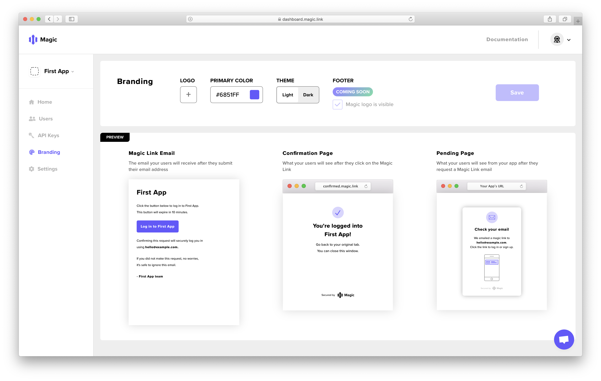
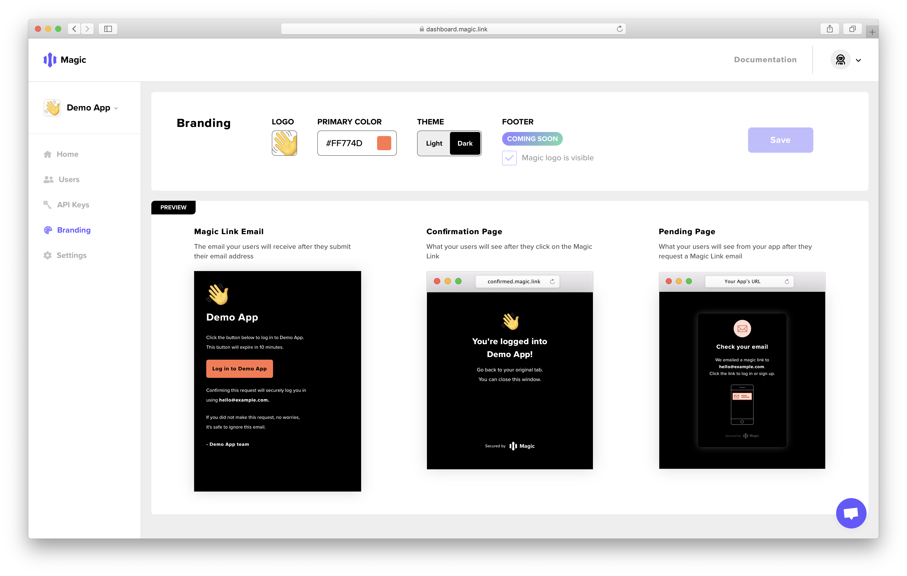

# 🎨 Customization

Magic includes a default pending modal UI to save developers implementation time and to get passwordless login working ASAP. But we also allow developers to have full customizability of their user on-boarding experience.



### Customize the UI & email

You can customize the logo and colors of the Magic link email, confirmation screen, and pending modal on the **Branding** tab in the [**Magic Dashboard**](https://dashboard.magic.link/)**:**



### Custom Email HTML Template

_\(You'll be able to set a custom html template for the Magic link email soon!\)_  


### Bring your own UI

To completely hide away our Pending Modal UI, you can simply pass `false` to the `showUI` attribute while initiating the Magic link login.

```javascript
import { Magic } from 'magic-sdk';
const magic = new Magic("YOUR_PUBLIC_API_KEY");

await magic.loginWithMagicLink({
    email,
    showUI: false // Default "true", setting "false" will hide loading screen
});
```

 

