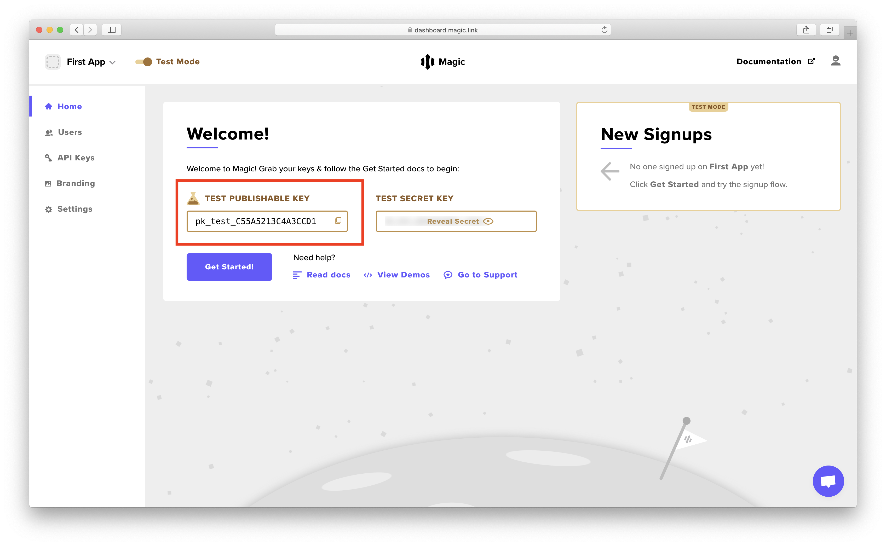

# 🚀 Get Started

## 🏗️ Get Template Code

Let's get started by building a simple interface to let users log in or log out via an email magic link experience. We've created a template with necessary html and styles on CodeSandBox. 


**👉 Go to our** [**Hello World Template**](https://go.magic.link/hello-world-template) **to continue this tutorial!**


_If you don't want to go through the walkthrough,_ ****_feel free to skip to the_ [_completed implementation_](https://go.magic.link/hello-world-code) _or watch the demo video below._



## 🗺️ Walkthrough

### 1️⃣ Install Magic SDK

Install Magic SDK to your template by simply including a script tag after the comment line in the CodeSandBox editor. You can start by copy and pasting the code snippet below to your editor under the comment.

```markup
<!-- 1️⃣ Install Magic SDK -->
<script src="https://cdn.jsdelivr.net/npm/magic-sdk/dist/magic.js"></script>
```

_See other ways to_ [_install Magic SDK_](client-sdk/browser-js/get-started.md) _such as using yarn or npm._

### 2️⃣ Initialize Magic Instance

You can initialize a Magic instance with your Publishable API Key with the following code. Copy and paste this code snippet below to your editor under the comment.

```javascript
/* 2️⃣ Initialize Magic Instance */
const magic = new Magic("YOUR_TEST_PUBLISHABLE_API_KEY");
```

You need to sign up or log in to the [**Magic Dashboard**](https://dashboard.magic.link/) to view your API keys. Once you are logged in, you can then update the `'YOUR_TEST_PUBLISHABLE_API_KEY'` string to your actual test _publishable_ API key, which looks something like `pk_test_*********`.



### 3️⃣ Implement Render Function

Next, to complete the setup, let's write the logic on what the Hello World app should display when **\(1\) users are not logged in**, and when **\(2\) users are logged in**. Copy and paste this code snippet below to your editor under the comment.

```javascript
/* 3️⃣ Implement Render Function */
const render = async () => {
  const isLoggedIn = await magic.user.isLoggedIn();
  /* Show login form if user is not logged in */
  let html = `
    <h1>Please sign up or login</h1>
    <form onsubmit="handleLogin(event)">
      <input type="email" name="email" required="required" placeholder="Enter your email" />
      <button type="submit">Send</button>
    </form>
  `;
  if (isLoggedIn) {
    /* Get user metadata including email */
    const userMetadata = await magic.user.getMetadata();
    html = `
      <h1>Current user: ${userMetadata.email}</h1>
      <button onclick="handleLogout()">Logout</button>
    `;
  }
  document.getElementById("app").innerHTML = html;
};
```

### 4️⃣ Implement Login Handler

Now the real fun begins! Check out how you can implement user login with **a single line of code**, without needing to write any backend code! Copy and paste this code snippet below to your editor under the comment.

```javascript
/* 4️⃣ Implement Login Handler */
const handleLogin = async e => {
  e.preventDefault();
  const email = new FormData(e.target).get("email");
  if (email) {
    /* One-liner login 🤯 */
    await magic.auth.loginWithMagicLink({ email });
    render();
  }
};
```

### 5️⃣ Implement Logout Handler

To wrap it all up, it's super easy to implement user logout as well. Copy and paste this code snippet below to your editor under the comment.

```javascript
/* 5️⃣ Implement Logout Handler */
const handleLogout = async () => {
  await magic.user.logout();
  render();
};
```


🎉 **Congratulations!** Now that you've completed the walkthrough, you should have a working version of the Hello World app! Don't worry if things are not working for some reason - you can find the [completed working version](https://go.magic.link/hello-world-code) on CodeSandBox.


## 👉 What's Next

Now that you have an understanding of how Magic works on the client-side, we _strongly recommend_ you to take a look at an end-to-end, full-stack example to learn about how to connect it to a Node.js backend server and see the full potential of Magic!



Did you know you can actually customize the login experience \(using your own UI instead of the default\) and also have a branded magic link email? You can learn how to do that with the link below!



Learn about how to use the popular [**Next.js**](https://nextjs.org/) framework to build a React app and deploy it with [**Vercel**](https://vercel.com/)!



Magic provides much flexibility and composability to be combined with many other powerful platforms such as Firebase. You can learn how to plug Magic into the entire Firebase suite of tools here!



