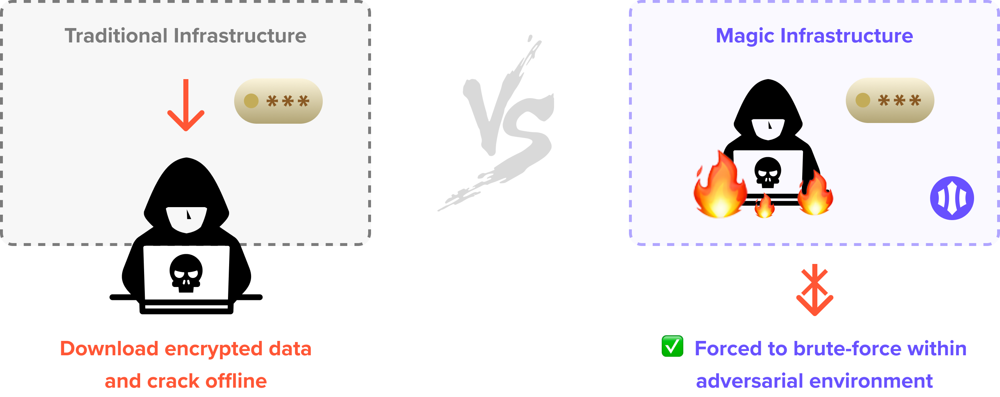

# 🛡️ Security

## Background


📜 You can also dive into the deep-end by reading Magic's [**Whitepaper**](https://www.dropbox.com/s/3flqaszoigwis5b/Magic%20Whitepaper.pdf?dl=0)**.**


### Rationale

Managing user identity and protecting the authentication and authorization processes are serious responsibilities. Mistakes can lead to unauthorized access and even financial loss from compromised user privacy or identity. To be able to manage all of this, perform penetration tests and audits, and staying on top of the security trends are _huge_ endeavors and may require full-sized security teams to execute correctly. In the age of ever-increasing cybersecurity threats, most software companies do not want this high level of responsibility and liability.

Worldwide spending on cybersecurity is projected to reach $133.7 billion in 2022 \[[Gartner](https://www.gartner.com/en/newsroom/press-releases/2018-08-15-gartner-forecasts-worldwide-information-security-spending-to-exceed-124-billion-in-2019)\], and the average cost of a breach has skyrocketed to around $3.92 million as of 2019 \[[Security Intelligence](https://securityintelligence.com/posts/whats-new-in-the-2019-cost-of-a-data-breach-report/)\]. Even though Equifax was breached in 2017, the company is still paying off the $4 billion damage in total.

We believe something _has_ to be done about this and created Magic to address many of these underlying security challenges in the world of identity and package them in an extremely accessible product for both developers and users.

### Who Are We

Magic is built by our team at [Fortmatic Inc](https://fortmatic.com/). We are a cybersecurity company headquartered in San Francisco, specializing in blockchain private key management.

We are inventors of Delegated Key Management \(pat. pend. USPTO 62/904689\), which enables hardware-secured, non-custodial management of users' private keys that are used to authenticate and make crypto-asset transactions on blockchain-based applications a.k.a decentralized applications.

The inspirations for Magic came from our experience working with developers building these applications, and how their users can leverage elliptic curve cryptography and public-private key pairs to generate zero-knowledge proofs that can be used to authenticate users into these applications.

### Why Passwords Are Obsolete

Most applications today are built with username/email/phone + password security model, which are obsolete for many reasons:

#### **Password leaks are prevalent**

Type your email in [HaveIBeenPwned](https://haveibeenpwned.com/) and realize that your sensitive data and passwords have likely been compromised in many high profile breaches impacting companies like Equifax, Dropbox, Adobe, Kickstarter, LinkedIn, Tumblr, and so many more. If there exists a database with passwords, it’s only a matter of time before they get stolen.

#### **Even hashed+salted passwords are insecure**

Once a database of hashed passwords is stolen, hackers can direct immense distributed computing resources at that database of passwords, utilizing parallel GPUs or botnets with hundreds of thousands of nodes to attempt hundreds of billions of password combinations per second in hopes of recovering plaintext identifier+password pairs.

Once attackers discover a password that hashes to the same hash as the one stored in the database, they’ll take that identifier+password pair and try it on other applications like bank accounts. In many cases, a salted+hashed password database can give up another valid identifier+password pair around every minute. This results in about half a million leaked passwords per year on its own — doubling every few years.

For companies using passwords as secrets to encrypt sensitive data, it's very much like symmetric encryption where the encryption key is a weak password that can be easily cracked by brute-force.

#### **User sessions often get hijacked**

User sessions are often [hijacked](https://owasp.org/www-community/attacks/Session_hijacking_attack) after successful authentication, allowing attackers to exploit that user’s application resources. In order to prevent that, you’d need to re-authenticate the user with every request, and this would create an extremely cumbersome user experience if users have to type in their password every single time.

Eric Elliott wrote a great [article](https://medium.com/javascript-scene/improving-user-authentication-and-security-ddb60b1ef69b) and covered many of these issues as well.

#### Managing passwords increases cost and liability

81% of all breaches are due to passwords, and 59% of people reuse their passwords _everywhere_ \[[Source](https://www.tracesecurity.com/blog/articles/81-of-company-data-breaches-due-to-poor-passwords)\], and breaches are costing companies on average $240k per 1k records \[[Source](https://digitalguardian.com/blog/whats-cost-data-breach-2019)\].

Over 50% of all support tickets are password-related \(usually forgotten passwords\). Each ticket costs companies around $70 - handling 10 tickets daily will cost an organization close to $128k annually \[[Source](https://www.okta.com/blog/2019/08/how-much-are-password-resets-costing-your-company/)\].

## Architecture

### Canonical Exfiltration Attacks

To protect against data breaches, one needs to understand how modern-day data-exfiltration attacks are commonly executed:

1. **Recon** -  Attacker researches, profiles, and tests the victim company's environment and people.
2. **Infiltrate** - Attacker breaks in or takes positions inside the organization.
3. **Discover** - Attacker leverages internal position to learn more about the environment and system.
4. **Capture** - Attacker takes control of valuable user data \(including passwords and credentials\).
5. **Exfiltrate** - Attacker moves encrypted data out, use offline compute resources crack them offline.
6. **Monetize** - Attacker sells or uses decrypted data to make money or gain advantage.

What's scary about this procedure is that, since encrypted data can be cracked offline, sometimes the victim company won't even realize they are compromised until months later, if ever.

Now we have a brief understanding of how canonical exfiltration attacks are executed. To prevent an attacker from cracking user password credentials and data offline, we have to \(1\) figure how users can authenticate into applications without passwords, and \(2\) ensure sensitive user data are "locked" by something that can't physically leave Magic's infrastructure.

### Zero-Knowledge Proofs

What if you can actually securely authenticate users into your applications without needing user credentials like passwords at all?  🤯 Turns out the answer is hiding in plain sight - developers have been using public-private key-pairs as a form of secure authentication for everyday jobs, like accessing SSH, where using passwords are sometimes optional.

Instead of SSH key-pairs, for each application end-user, Magic generates a key-pair based on the [Ethereum](https://en.wikipedia.org/wiki/Ethereum) decentralized blockchain network. The public key acts as an identifier for the user. Leveraging elliptic curve cryptography, the private key is used to generate a verifiable proof of identification and authorization from a claim. The proof is then sent to the developer application servers where data in the claim can be recovered, and the authenticity of the request can be ensured. Voilá! Authentication and authorization are achieved without requiring user passwords. The claim format is an adaptation of the W3C [Decentralized Identifiers](https://w3c-ccg.github.io/did-primer/) \(DID\) protocol \[[Learn More](tutorials/decentralized-id.md)\].

### Delegated Key Management

With this public-private key-pair approach, it is critical to ensure that users' private keys are properly secured, otherwise, it would mean their identity can be compromised. From what we know about data exfiltration attacks, databases are absolutely the _worst_ place to store these keys. This is where our secret sauce, Delegated Key Management \(pat. pend. USPTO 62/904689\), which has been securing tens of thousands of user private keys for thousands of blockchain companies, is very effective at doing.

#### Hardware Security Modules

Magic leverages Hardware Security Modules \(HSMs\) provided by Amazon Web Services' Key Management  Service \(AWS KMS\). Dedicated user master keys are stored on the HSMs, which are generated using AES-256 with 384-bits of entropy. The master keys never leave the hardware as they are meant to be locked inside and unable to be exported, where all encryption and decryption operations happen inside the hardware itself. HSMs are a lot like popular FIDO devices like YubiKeys or hardware-based wallets for cryptocurrency storage such as Trezor or Ledger, but instead, they sit in the cloud, heavily secured by [AWS’s data centers](https://aws.amazon.com/compliance/data-center/controls/).

Users' private keys are encrypted by these hardware-based user master keys, which means that attackers need to gain access to these hardware to be able to retrieve the keys, and are forced to stay _within_ Magic's adversarial infrastructure - which is capable to detect, impede, and monitor attacker's progress to prevent and mitigate any damages.

#### Non-Custodial Trust Optimization

Our Delegated Key Management architecture _delegates_ critical encryption and decryption operations to a trusted AWS KMS and AWS Cognito - completely bypassing the Magic backend. This way, we can stay non-custodial \(standard for trust amongst crypto communities\) since we’ll never “see” users’ private keys, and therefore improving security and trust with developers and end-users.

### Client to AWS Data Flow 

For users to access their HSMs, they authenticate with the Magic auth relayer. Upon successful authentication, users receive a time-bound access token, which is traded for scoped credentials, and in turn, allows the client to interact with AWS directly. The scoped credentials exclusively enable _users_ to call the AWS to access their master keys stored on the HSM for encryption and decryption. This mechanism bypasses the Magic backend entirely, and Magic cannot forge nor intercept the scoped credentials because they are generated by the operations exclusively between the clients and AWS. Both access tokens and scoped credentials are created dynamically by AWS, with audit logs, and with TTLs enabled.

When a user signs up, a public-and-private key-pair is generated on the client-side for the user inside an iframe, inaccessible by the integrated app. Keys are generated with cryptographically secure pseudo-random 256-bit of entropy. Once generated, the key is then encrypted by the Delegated Key Management, where Magic never sees the raw private keys at any part of the flow. After encryption of the keys with the HSM, the encrypted key is then stored on the client-side iframe as well as uploaded to the Magic auth relayer for redundancy, in case the encrypted key on the client-side is accidentally removed. To ensure Magic cannot decrypt the encrypted key for redundancy, we have removed our permission to decrypt with our KMS instances. 

When users authenticate again, the encrypted private key is downloaded to the client. Users can then decrypt the encrypted private key directly with AWS KMS via Cognito.

### Phishing Protection

[Phishing attacks](https://en.wikipedia.org/wiki/Phishing) are an ongoing problem that exists in our industry today. However, this doesn't mean we are satisfied with the status quo, and are actively working to mitigate this. We have minimized the attack vectors significantly by going passwordless—**no credentials are passed around!** Compared to traditional password-based solutions, Magic eliminates the case where users can be phished of compromising account information.

Plus, if a magic link email is lost or stolen \(or even somehow compromised in transit\), a user's account is safe! The token included in the magic link email is only privileged to verify a login request _from the device and/or browsing context that initiated the request._ An attacker would require physical access to the user's device _and_ unencrypted email inbox to be malicious.

However, a motivated attacker could create an identical replica of your application, which is a known phishing pattern that occurs today. For this case, we recommend developers to whitelist **specific domains for their public API keys on the** [**Magic Dashboard**](https://dashboard.magic.link) so that illegitimate applications cannot forge requests through the Magic SDKs.

### CSRF and XSS

CSRF and XSS are all the common attack vectors for web applications. Magic regularly audits 3rd-party scripts to enforce strict CSP headers to mitigate XSS and untrusted data ingestion exploits. CSRF tokens are used to ensure requests’ authenticity, which prevents users’ requests from being forged by malicious attackers. We adopt industry-best engineering practices building our products to make sure we are not vulnerable to any untrusted data injection. We are also rigorously implementing security controls and monitoring to protect the end-users further.

### E2E TLS Encryption

Transport Layer Security \(TLS\) is the standard protocol for encrypting data on the Internet. Web services provided over the Internet without TLS should be strongly discouraged. At Magic, all service communication is forced to be on TLS. No matter user data transported between Magic servers and user browser is sensitive or not, it is end-to-end encrypted. This applies to the 3rd-party services that we made available to the end-users. But Magic doesn’t stop there. We took it further and implemented TLS for our internal service communication. The communication between our servers and the internal application secret storage, [Hashicorp Vault](https://www.vaultproject.io/), is also encrypted by the TLS. In the unlikely event of Magic servers being infiltrated, none of the sensitive data transported on the internal network is in plaintext.

By implementing TLS, it prevents man-in-the-middle attacks. Users using services provided by Magic are protected end-to-end.

### Network Setup 

Magic deploys services in virtual private clouds \(VPC\). Each environment \(dev, stage, and prod\) has a dedicated VPC, and no communication is allowed between VPCs except with the VPN’s VPC. Within a VPC, we split up our network into public subnets and private subnets. Public subnets are the only network with Internet access. Services deployed in public subnets are accessible to the world, whereas the ones in the private subnets aren’t. This allows us to deploy core business logic in the private network and protect those services from the Internet.

### Intrusion Detection Setup

Magic deploys intrusion detection systems in its cloud environment. We analyze all of our VPC logs, DNS logs and service logs to detect threats and any unauthorized access. We continuously monitor the traffic and take action when needed.

### Data Encryption at Rest 

Magic encrypts all of its databases, snapshots, automated backups and replicas with the industry-standard AES-256 encryption algorithm. The encryption and decryption are done automatically when data is written and read from the data storage.

## Security Audit and Compliance 

### SOC 2 Type 1

Magic's infrastructure has been thoroughly audited by [NCC Group](https://www.nccgroup.trust/us/) and [A-LIGN](https://a-lign.com/) and is **SOC 2 Type 1** compliant \(SOC 2 Type 2 in progress\). All the controls and procedures required by the compliance have been implemented at Magic.

Security and trust are the top priority. They’re not just architecture, but also intensive process and diligence around privacy, confidentiality, risk mitigation, and business continuity. Magic is also insured for cybercrime damage and loss.

#### What's covered in our SOC 2 Information Security Management System \(ISMS\) 

| Technology | Process | Business |
| :--- | :--- | :--- |
| Encryption and Key Management | Privacy and Security Training | Business Continuity |
| Incident Response | Secure Information Handling | Risk Management |
| Network & Remote Access | Vulnerability Management | Information Privacy & Security Governance |
| Identity and Access Management | Asset Management | Physical and Environmental Security |
| Device Security | Configuration and Change Management | Vendor Management |
| Email and Messaging | Data Classification | Human Resources Information Security |
| Logging | Data Retention and Disposal | Technology Acceptable Use |

### HackerOne

We also participate in white-hat hacker events and run a private program on [HackerOne](https://www.hackerone.com/) \(if you are interested in joining the program, please send us a message to [security@magic.link](mailto:security@fortmatic.com) with your H1 username\). Magic's infrastructure also goes through vigorous penetration testing at least once a year.

If you find any security vulnerability, please report it to [security@magic.link](mailto:security@fortmatic.com). If you are not in our bounty program, we would love to invite you to join our program on HackerOne. Bounty will be awarded if it is confirmed a valid vulnerability.

