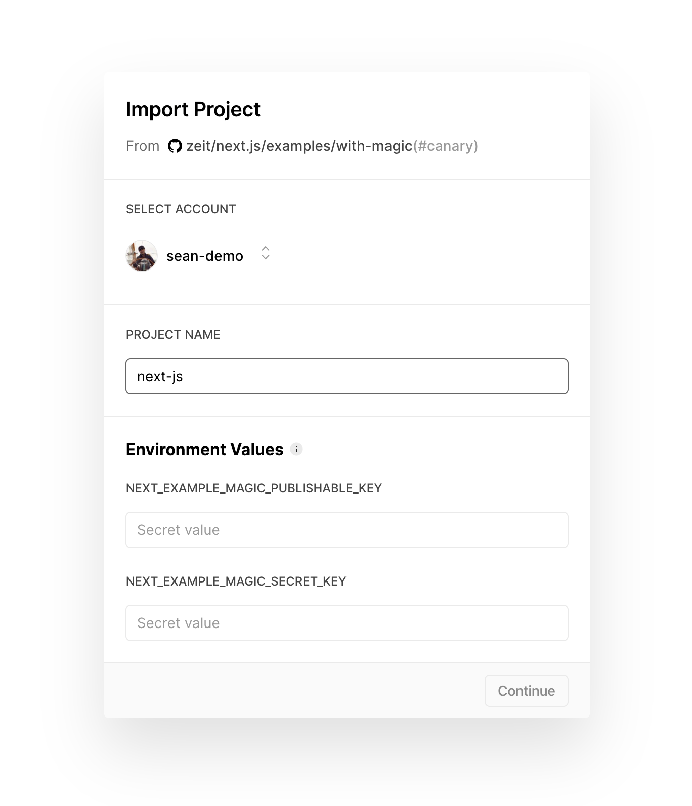
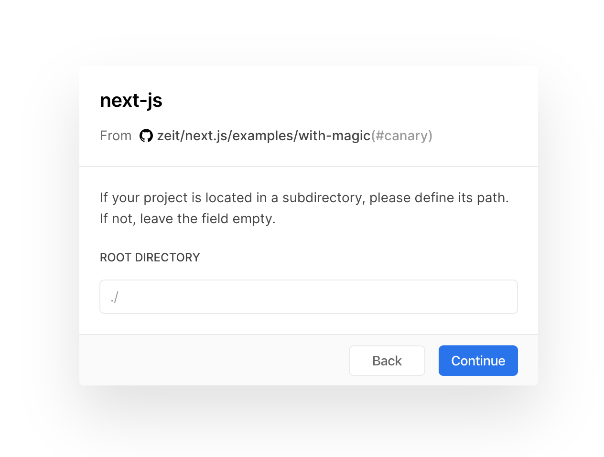
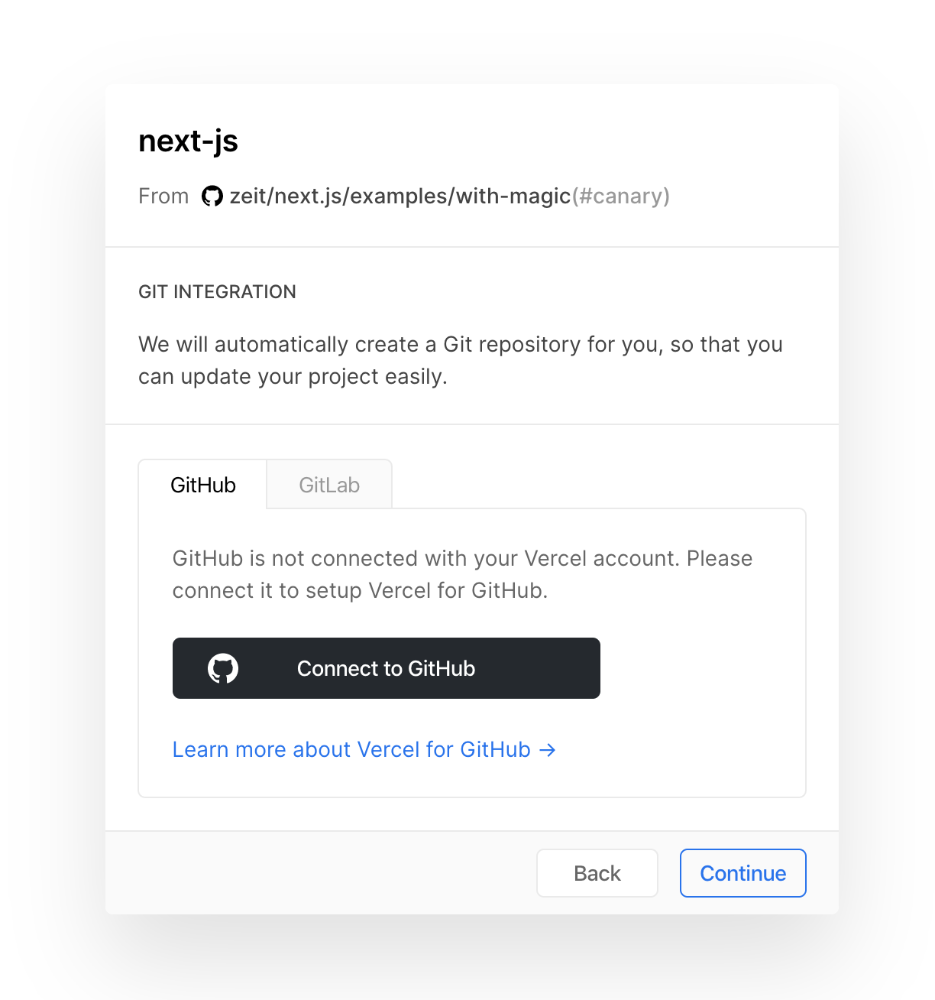
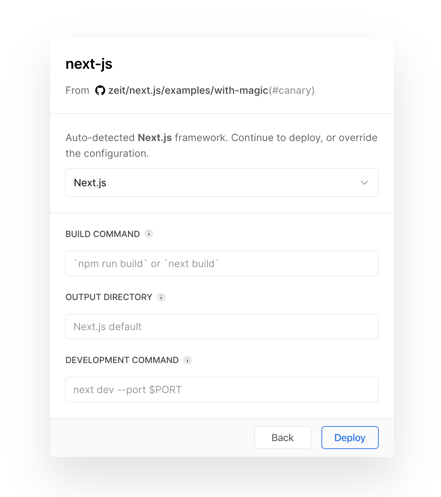
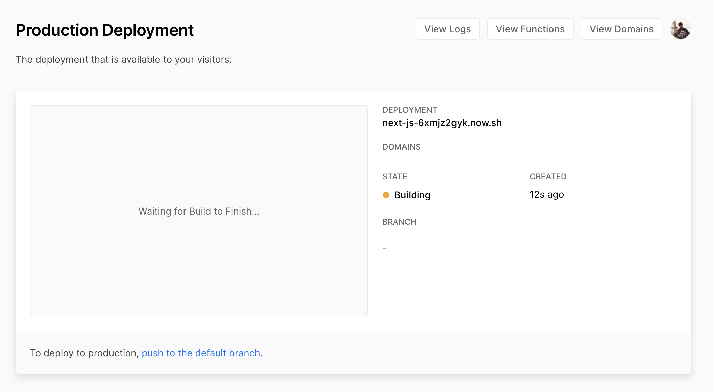
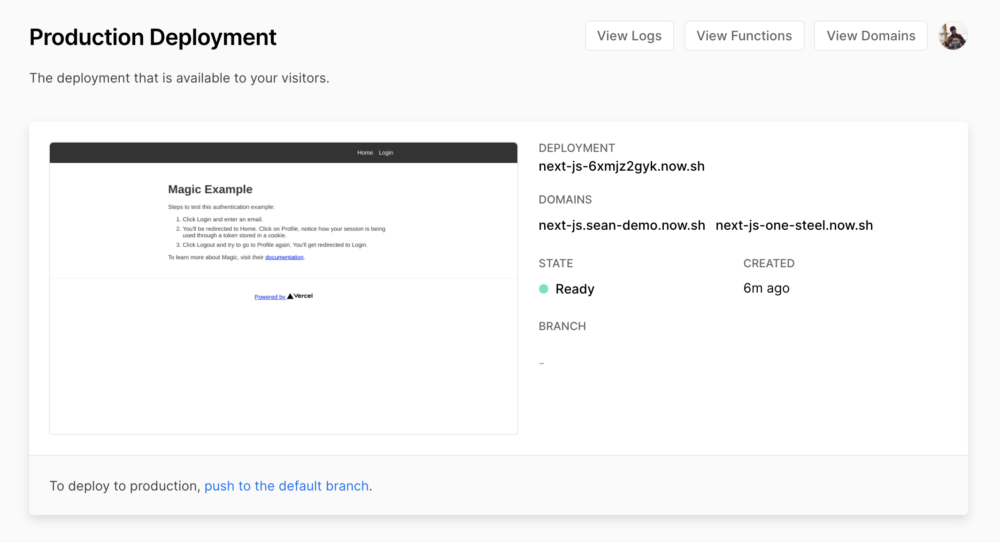

# ▲ Next.js Integration

\*\*\*\*[**Next.js**](https://nextjs.org/) ****is a popular React Framework with many built-in features, such as:

* An intuitive page-based routing system \(with support for dynamic routes\)
* Pre-rendering, both static generation \(SSG\) and server-rendering \(SSR\) are supported on a per-page basis
* Automatic code splitting for faster page loads
* Client-side routing with optimized prefetching
* Built-in CSS and Sass support, and support for any CSS-in-JS library
* Development environment which supports Hot Module Replacement
* API routes to build API endpoints with Serverless Functions
* Fully extendable

A Next.js application can also be seamlessly deployed with [**Vercel**](https://vercel.com/) - an all-in-one platform for static & Jamstack deployment, serverless functions, and global CDN. 

## 🚀 Deploy Next.js Magic Example

In this tutorial, we will be showing how to integrate Magic authentication with an example Next.js application, where users can sign up/login, get profile info, and logout.

Deploying and iterating on a Next.js application is super easy. You can simply click on the link below to get started:

👉 [**Deploy Next.js Magic Example**](https://vercel.com/new/project?template=https://github.com/zeit/next.js/tree/canary/examples/with-magic)\*\*\*\*

### 1️⃣ Configure Environment Values

After you click on the [**Deploy Next.js Magic Example**](https://vercel.com/new/project?template=https://github.com/zeit/next.js/tree/canary/examples/with-magic) link, you'll be presented with the form shown above if you already have an account with Vercel, if not you'll be able to sign up for a new account. Note there are two **Environment Values** are required to continue `NEXT_EXAMPLE_MAGIC_PUBLISHABLE_KEY` and `NEXT_EXAMPLE_MAGIC_SECRET_KEY` .

To grab these two values, you need to sign up or log in to the [**Magic Dashboard**](https://dashboard.magic.link/) to view your API keys. Once you are logged in you, you can then update the `'NEXT_EXAMPLE_MAGIC_SECRET_KEY'` string to your actual _secret_ API key, which looks something like `sk_test_*********`.

Once that's done, you can update the `'NEXT_EXAMPLE_MAGIC_PUBLISHABLE_KEY'` string to your publishable API key, which looks something like `pk_test_*********`.

Once the keys are copy and pasted in the **Environment Values** field, you can hit **Continue**.

Nothing needs to be changed here, hit **Continue** again.

### 2️⃣ Setup Github Repository

You now have the option to connect your Github account and create a repository based on Next.js's official [**`with-magic`**](https://github.com/zeit/next.js/tree/canary/examples/with-magic) example.

### 3️⃣ Deploy Application

Now you are presented with the screen below, nothing needs to be changed, simply hit **Deploy** to start the production deployment of the Next.js Magic example application!


Now you can visit [**next-js.sean-demo.now.sh**](https://next-js.sean-demo.now.sh/) \(or your application's URL\) to check out your freshly deployed application!


Now you can also check out the Next.js Magic [**open source example**](https://github.com/zeit/next.js/tree/canary/examples/with-magic) to learn more about the implementation and start building your application from this boilerplate if you've setup a Github repository from Step 2!

