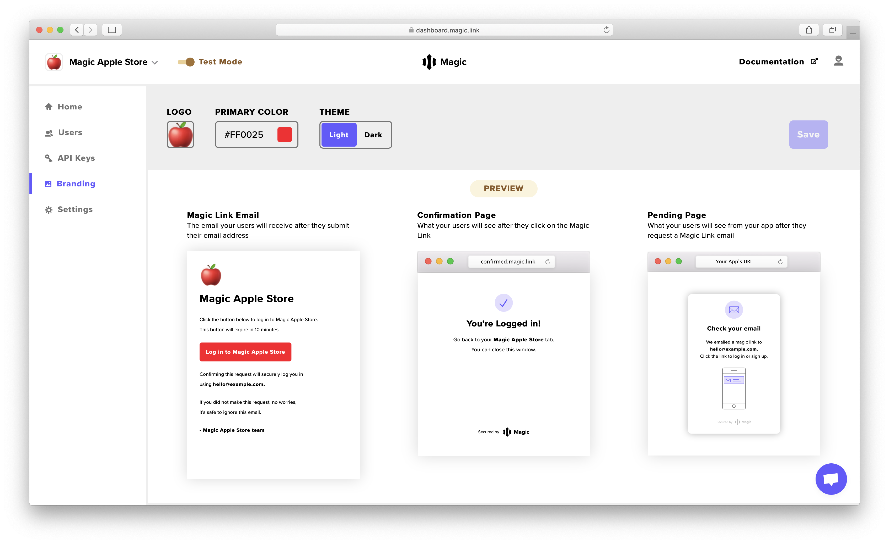

# 🎨 Customization

Magic includes a slick default loading screen to save developers implementation time, but also allows developers to have full customizability of their user on-boarding experience!

### Hide Loading Screen

To completely hide away our loading screen UI, you can simply pass `false` to the `showUI` attribute while initiating the Magic link login.

```javascript
import { Magic } from 'magic-sdk';
const magic = new Magic("YOUR_PUBLIC_API_KEY");

await magic.loginWithMagicLink({
    email,
    showUI: false // Default "true", setting "false" will hide loading screen
});
```

### Use Your Own Brand

You can also apply your own brand and theme to the Magic link email, loading screen, as well as the confirmation screen. Simply head to the **Branding** tab on the [**Magic Dashboard**](https://dashboard.magic.link/) and you'll be able to add your logo, set your primary brand color, and choose between a light or dark theme! _\(You'll be able to set a custom html template for the Magic link email soon , too.\)_



 

