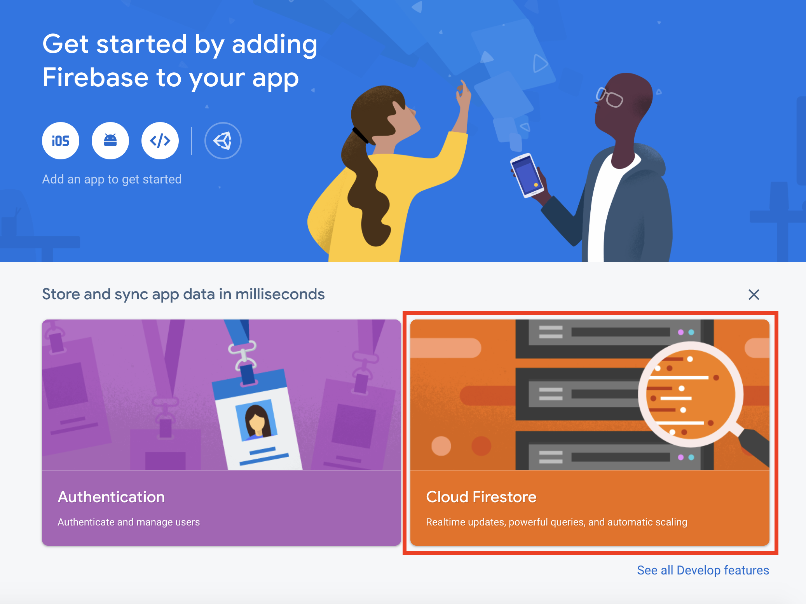
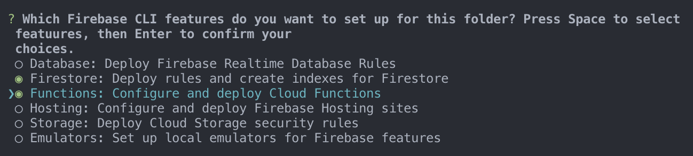
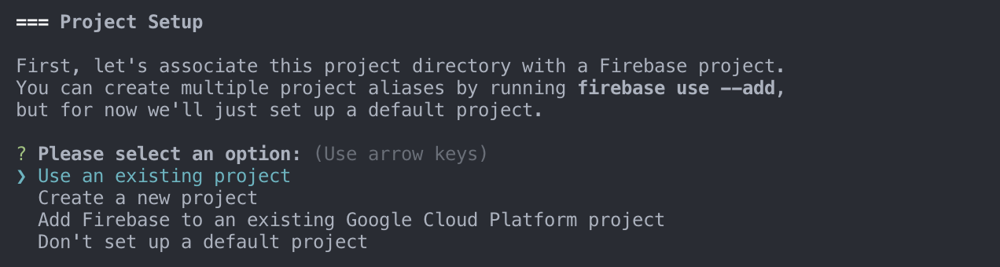
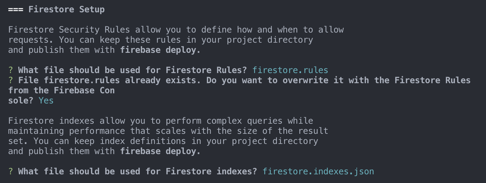
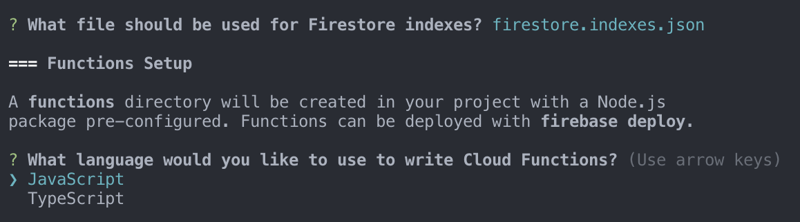
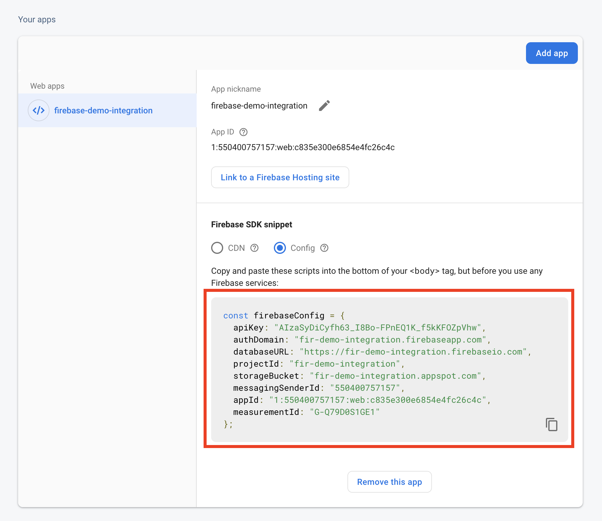
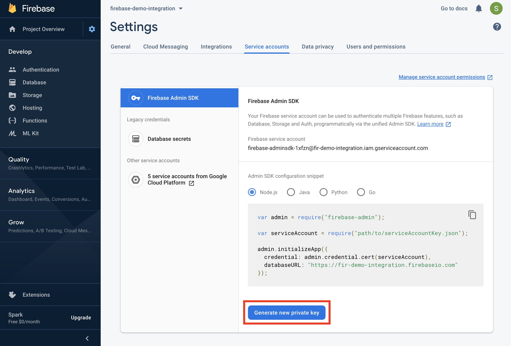
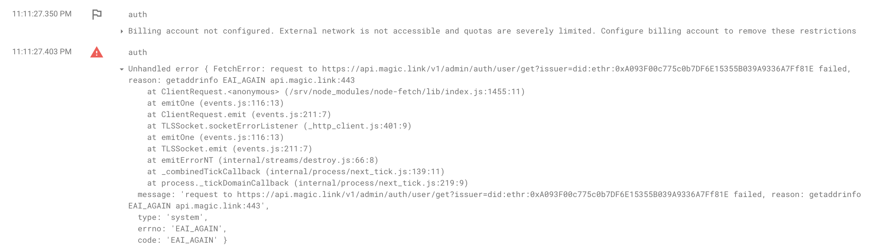

# 🔥 Firebase Integration

Magic works out of the box with Firebase - seamlessly connecting state-of-the-art, no lock-in identity and authentication to the immense power of the Google platform.

This end-to-end example will adapt the [Magic Apple Store](full-stack-node-js.md) example into a Magic + Firebase application leveraging Firebase's powerful [Cloud Functions](https://firebase.google.com/docs/functions) and [Firestore](https://firebase.google.com/docs/firestore).

## 📦 Setup Cloud Functions Project

This section is to help new developers who don't already have a project with Firebase Cloud Functions setup. **If you already have an** _**existing**_ **Cloud Functions project, feel free to skip to the** [**Next Section**](firebase-integration.md#connect-magic-to-firebase-auth)**!**

### Create a Firebase Project

1️⃣ In the [Firebase console](https://console.firebase.google.com/), click **Add project**, then select or enter a **Project name**.

2️⃣ Click **Continue** through the steps and then Click **Create project**.

3️⃣ After a minute or so, your project will be successfully created. You can then continue to your project home page, where you can enable the **Firestore** database feature. 



4️⃣ After that you can click on the **Create database** button and you will be directed through a short flow to complete the setup. Don't worry too much about the secure rules yet, as we'll get to it later.


### Setup Node.js and the Firebase CLI

Now that your project is setup. You'll need a [Node.js](https://nodejs.org/) environment to write functions and properly initialize your project locally, and you'll need the Firebase CLI to deploy functions to the Cloud Functions runtime. Node.js versions 8 and 10 are [supported](https://firebase.google.com/docs/functions/manage-functions#set_nodejs_version). For installing Node.js and [npm](https://www.npmjs.org/), [Node Version Manager](https://github.com/creationix/nvm/blob/master/README.md) is recommended.

Once you have Node.js and npm installed, [install the Firebase CLI](https://firebase.google.com/docs/cli?#setup_update_cli) via your preferred method. To install the CLI via npm, use:

```text
npm install -g firebase-tools
```

### Initialize Firebase SDK for Cloud Functions

When you initialize Firebase SDK for Cloud Functions, you create an empty project containing dependencies and some minimal sample code, and you choose either TypeScript or JavaScript for composing functions.

**To initialize your project:**

1️⃣ Run `firebase login` to log in via the browser and authenticate the firebase tool.

2️⃣ Go to your Firebase project directory or create a new empty directory.

3️⃣ Run `firebase init` command to initialize your project.



Now you will see some options you'll be able to multi-select, pick _both_ the **Firestore** and **Functions** options to be able to go through this tutorial.

4️⃣ After that you will be presented an option to Use an existing project, pick this option and select the project name you just created on the [Firebase console](https://console.firebase.google.com/).



5️⃣ Select _Default_ or _Yes_ to every step after to initialize the Firestore configurations.



6️⃣ For the purpose of this tutorial, select _Javascript_ language option when presented for Cloud Functions configurations.



7️⃣ Continue the steps and after the npm packages are installed, your project will be fully initialized and        ready to go! 🔥

## 🔌 Connect Magic to Firebase Auth

Magic doesn't replace Firebase Auth, and can actually integrate seamlessly into it so you will be able to have the same permissions and database rules configurations as if it's native Firebase Auth. Before we go into writing the Magic + Firebase adapter Cloud Function, understanding the data flow on the front-end code will be very helpful.


If you'd like to skip straight to the implementation. Here's the [**complete front-end source code**](https://go.magic.link/apple-store-firebase-code) on CodeSandBox as well as the [**Firebase callable function code**](https://go.magic.link/magic-firebase-auth) on Github.


### Auth Data Flow

1. User logs in in with Magic link, which upon successful login, generates a [DID token](decentralized-id.md)
2. The DID token is passed into the `auth` Firebase `httpsCallable` Cloud Function that we will be implementing in later section
3. The `auth` Cloud Function takes in the DID token and converts it into a Firebase user access token
4. Pass the Firebase user access token into the `firebase.auth().signInWithCustomToken` method to authenticate user natively with Firebase

Here's a sample front-end code snippet to implement this data flow:

```javascript
/* Your Front-end Code */

...

/* User login with Magic link to get DID token */
const didToken = await magic.auth.loginWithMagicLink({ email });
const auth = firebase.functions().httpsCallable("auth");
/* DID token is passed into the auth callable function */
let result = (await auth({ didToken })).data;
/* Firebase user access token is used to authenticate */
await firebase.auth().signInWithCustomToken(result.token);

...
```

### Get Firebase Config

Setting up your Firebase front-end project properly can help avoid a lot of headaches later. Note that there's a `firebaseConfig` configuration in our example source code.  You'll be able to get this configuration in your project's settings view.




## 🔐 Implement Auth Callable Function

The Auth callable Cloud Function will be the crucial piece to converting a Magic DID token into a Firebase user access token to enable this entire experience. We'll go through the configuration steps first, but if you are already familiar with Cloud Function configurations, you can directly skip ahead to the function implementation or download the entire [**project example**](https://go.magic.link/magic-firebase-auth) ****from Github!

### Configure and Initialize

1️⃣ In your Cloud Functions file, you'll have to initialize Firebase with its admin SDK and your **service account credential**.

```javascript
require('dotenv').config();

const functions = require("firebase-functions");
const admin = require("firebase-admin");
const serviceAccount = require("./path/to/my-project.json");

admin.initializeApp({
  credential: admin.credential.cert(serviceAccount),
  databaseURL: "https://my-project.firebaseio.com"
});
```

2️⃣ Getting the **service account credential** is extremely important to make sure you have the right permissions to create the Firebase user access token. You can find it in your **Project settings** page, under the **Service accounts** tab, and then click on **Generate new private key**.



3️⃣ After downloading the credential, you can put the `.json` credential file into your project directory and update the path in the `const serviceAccount = require("./path/to/my-project.json");` line, as well as updating the `databaseURL` to the one you see in your project settings dashboard.


These are your firebase server side credentials, keep them secret!


### Function Implementation

After all the setup, now let's finally get to the fun part! 🎉 Essentially the `auth` callable function handles authentication for two types of scenarios **\(1\) existing users who already have email addresses set, including legacy Firebase users**, and **\(2\) create new users based on their email addresses and** [**DID**](decentralized-id.md) **token generated by Magic**. This callable function will return a unique Firebase user access token and pass it back to the client.

This is a sample implementation on how you can implement this auth function based on those two scenarios via two handler functions:

```javascript
exports.auth = functions.https.onCall(async (data, context) => {
  const { Magic } = require("@magic-sdk/admin");
  const magic = new Magic("YOUR_SECRET_API_KEY");
  const didToken = data.didToken;
  const metadata = await magic.users.getMetadataByToken(didToken);
  const email = metadata.email;
  try {
    /* Get existing user by email address,
       compatible with legacy Firebase email users */
    let user = (await admin.auth().getUserByEmail(email)).toJSON();
    const claim = magic.token.decode(didToken)[1];
    return await handleExistingUser(user, claim);
  } catch (err) {
    if (err.code === "auth/user-not-found") {
      /* Create new user */
      return await handleNewUser(email);
    } else {
      throw err;
    }
  }
});
```

The existing user handler function takes in the existing user object from Firebase and the claim from the DID token to check for [replay attack](https://go.magic.link/replay-attack), and if successful, generates and returns a valid Firebase user access token.

```javascript
const handleExistingUser = async (user, claim) => {
  /* Check for replay attack (https://go.magic.link/replay-attack) */
  let lastSignInTime = Date.parse(user.metadata.lastSignInTime) / 1000;
  let tokenIssuedTime = claim.iat;
  if (tokenIssuedTime <= lastSignInTime) {
    throw new functions.https.HttpsError(
      "invalid-argument",
      "This DID token is invalid."
    );
  }
  let firebaseToken = await admin.auth().createCustomToken(user.uid);
  return {
    uid: user.uid,
    token: firebaseToken
  };
};
```

The new user handler function takes in the email and creates a new Firebase user based on it, and then generates and returns a valid Firebase user access token.

```javascript
const handleNewUser = async email => {
  const newUser = await admin.auth().createUser({
    email: email,
    emailVerified: true
  });
  let firebaseToken = await admin.auth().createCustomToken(newUser.uid);
  return {
    uid: newUser.uid,
    token: firebaseToken
  };
};
```


You can find the complete [**auth callable function project**](https://go.magic.link/magic-firebase-auth) on our Github.


## 🚀 Wrapping Up

### Configure Firestore Rules

After you've implemented the `auth` callable function, go to the `firestore.rules` file in your local project directory and update it with the following - essentially only allowing the currently authenticated user to perform CRUD in the `users` collection.

```javascript
rules_version = '2';
service cloud.firestore {
  match /databases/{database}/documents {
    match /users/{userId} {
      allow read, write: if request.auth.uid == userId;
    }
  }
}
```

### Deploy to Firebase

Now you can simply run the following command with the Firebase CLI in your project directory to deploy your code to Firebase! 🎉

```javascript
firebase deploy
```

## 👷 Troubleshooting

### EAI\_AGAIN Error

If you are seeing an error like below in your Firebase Cloud Functions log, it's because Firebase requires project **Billing** to be configured before enabling access to external networks.



