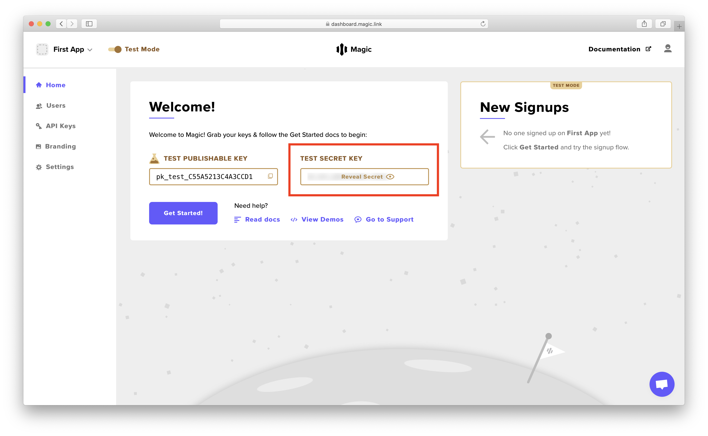

# 🍎 Full Stack Node.js

## 🏗️ Get Template Code

Welcome to our end-to-end example to demonstrate how Magic works with your own Node.js  server using the popular [Express](https://expressjs.com/) framework! If you haven't gone through the [Get Started](../get-started.md) guide, we strongly recommend going through it before starting this tutorial!

In this example, we'll be implementing an additional feature in the Hello World example - **letting only authorized users buy apples 🍎 and see how many they own!**


**👉  Get our** [**Template Code**](https://go.magic.link/apple-store-nodejs-template) **to continue this tutorial!** 

Since there are quite a few steps, we'll be walking through each of the steps in this documentation instead of letting you copy and paste them.

Feel free to play around with the final [live app](https://go.magic.link/apple-store-nodejs) to get a sense of what we are building. _\(You may have to log in to CodeSandBox to access it\)_


## 🗺️ Walkthrough

The full stack Node.js server is set up using the vanilla Express template on CodeSandBox, using [NeDB](https://github.com/louischatriot/nedb) as an ultra lightweight database \(you can switch it to other databases like MongoDB too\) and the [`express-session`](https://github.com/louischatriot/nedb) NPM package to manage sessions. Since it's a relatively bigger example, we'll be mostly focus this section on the **`routes/user.js`** file.

### 1️⃣ Setup Magic Admin SDK

This is how you can import the Magic _Admin_ SDK \(strictly for server-side use\) to your application. You can learn how to install it via npm or yarn in the [Node.js reference](../admin-sdk/node-js/get-started.md#installation).

```javascript
/* 1️⃣ Setup Magic Admin SDK */
const { Magic } = require("@magic-sdk/admin");
const magic = new Magic("YOUR_TEST_SECRET_API_KEY");
```

You need to sign up or log in to the [**Magic Dashboard**](https://dashboard.magic.link/) to view your API keys. Once you are logged in you, you can then update the `'YOUR_TEST_SECRET_API_KEY'` string to your actual test _secret_ API key, which looks something like `sk_test_*********`.



While you are at it,  go to the `public/index.html` file, and update `'YOUR_TEST_PUBLISHABLE_API_KEY'` string to your actual test _publishable_ API key, which looks something like `pk_test_*********`.

```javascript
/* In public/index.html */

...

<script src="https://cdn.jsdelivr.net/npm/magic-sdk/dist/magic.js"></script>
<script>
  const magic = new Magic("YOUR_TEST_PUBLISHABLE_API_KEY");
  const serverUrl = window.location.href;

...
```

### 2️⃣ Implement Auth Strategy

Magic leverages the popular and battle-tested [Passport](http://www.passportjs.org/) authentication middleware package for Express to provide our passwordless authentication service. This way it will be very seamless and easy to integrate for developers who are already familiar with Passport! _\(Don't worry if you are not, we'll go through comprehensive examples in this tutorial\)_ 

Magic's authentication is based on the [Decentralized ID](decentralized-id.md) \(DID\) token standard, and the strategy implemented by `passport-magic` already takes care of the heavy-lifting by verifying the token and  returning the authenticated user object. In this strategy, we'd like to define what to do if this user is a new user versus a returning user.

Note that in the DID standard we use `issuer` quite a lot, which looks something like `did:ethr:0xE0cef4417a772512E6C95cEf366403839b0D6D6D`, it represents a unique blockchain public address which can often be used as an identifier field. The issuer can be used to fetch the authenticated user's metadata, which includes their associated email address.

```javascript
/* 2️⃣ Implement Auth Strategy */
const passport = require("passport");
const MagicStrategy = require("passport-magic").Strategy;

const strategy = new MagicStrategy(async function(user, done) {
  const userMetadata = await magic.users.getMetadataByIssuer(user.issuer);
  const existingUser = await users.findOne({ issuer: user.issuer });
  if (!existingUser) {
    /* Create new user if doesn't exist */
    return signup(user, userMetadata, done);
  } else {
    /* Login user if otherwise */
    return login(user, done);
  }
});

passport.use(strategy);
```

### 3️⃣ Implement Auth Behaviors

#### Implement User Signup

The user signup behavior is pretty straightforward in this case, where a new user would be inserted into the NeDB database.

```javascript
/* 3️⃣ Implement Auth Behaviors */

/* Implement User Signup */
const signup = async (user, userMetadata, done) => {
  let newUser = {
    issuer: user.issuer,
    email: userMetadata.email,
    lastLoginAt: user.claim.iat
  };
  await users.insert(newUser);
  return done(null, newUser);
};
```

#### Implement User Login

Since authentication is token-based, the user login behavior needs to implement a timestamp check to protect against [replay attacks](https://go.magic.link/replay-attack) - here's a simple reference implementation, but you can make  adjustments depending on your security preference.

```javascript
/* Implement User Login */
const login = async (user, done) => {
  /* Replay attack protection (https://go.magic.link/replay-attack) */
  if (user.claim.iat <= user.lastLoginAt) {
    return done(null, false, {
      message: `Replay attack detected for user ${user.issuer}}.`
    });
  }
  await users.update(
    { issuer: user.issuer },
    { $set: { lastLoginAt: user.claim.iat } }
  );
  return done(null, user);
};

/* Attach middleware to login endpoint */
router.post("/login", passport.authenticate("magic"));
```

Here's an example of how to call the Login Endpoint from the client-side:

```javascript
/* In public/index.html */

...

const didToken = await magic.auth.loginWithMagicLink({ email });
await fetch(`${serverUrl}user/login`, {
  headers: new Headers({
    Authorization: "Bearer " + didToken
  }),
  withCredentials: true,
  credentials: "same-origin",
  method: "POST"
});

...
```

### 4️⃣ Implement Session Behavior

An awesome feature from the Passport middleware is the possibility to populate the `req.user` object with an actual database record, so that the data can be conveniently used in your endpoints. See the next section for more examples.

```javascript
/* 4️⃣ Implement Session Behavior */

/* Defines what data are stored in the user session */
passport.serializeUser((user, done) => {
  done(null, user.issuer);
});

/* Populates user data in the req.user object */
passport.deserializeUser(async (id, done) => {
  try {
    const user = await users.findOne({ issuer: id });
    done(null, user);
  } catch (err) {
    done(err, null);
  }
});
```

### 5️⃣ Implement User Endpoints

#### Implement Get Data Endpoint

This endpoint is responsible for grabbing the currently authenticated user's data, including the number of apples 🍎 to be displayed in the front-end! Note how this endpoint uses `req.isAuthenticated()` to check if the current user is authenticated, and `req.user` can be passed to the front-end without fetching from the database again!

```javascript
/* 5️⃣ Implement User Endpoints */

/* Implement Get Data Endpoint */
router.get("/", async (req, res) => {
  if (req.isAuthenticated()) {
    return res
      .status(200)
      .json(req.user)
      .end();
  } else {
    return res.status(401).end(`User is not logged in.`);
  }
});
```

Here's how you would call the Get Data Endpoint from the client-side:

```javascript
/* In public/index.html */

...

let res = await fetch(`${serverUrl}/user/`);
if (res.status == 200) {
  let userData = await res.json();
  let appleCount = userData.appleCount;
  ...
}

...
```

#### Implement Buy Apple Endpoint

Follows similar pattern as the Get Data Endpoint, instead authenticated user can now update and increment their apple count!

```javascript
/* Implement Buy Apple Endpoint */
router.post("/buy-apple", async (req, res) => {
  if (req.isAuthenticated()) {
    await users.update(
      { issuer: req.user.issuer },
      { $inc: { appleCount: 1 } }
    );
    return res.status(200).end();
  } else {
    return res.status(401).end(`User is not logged in.`);
  }
});
```

Here's how you would call the Buy Apple Endpoint from the client-side:

```javascript
/* In public/index.html */

const handleBuyApple = async () => {
  await fetch(`${serverUrl}/user/buy-apple`, { method: "POST" });
  render();
};
```

#### Implement Logout Endpoint

To log out the user, you can use the Magic Admin SDK to logout the current user based on the user ID, remember to also call `req.logout()` to clear the Express user session as well!

```javascript
/* Implement Logout Endpoint */
router.post("/logout", async (req, res) => {
  if (req.isAuthenticated()) {
    await magic.users.logoutByIssuer(req.user.issuer);
    req.logout();
    return res.status(200).end();
  } else {
    return res.status(401).end(`User is not logged in.`);
  }
});
```

With this, you no longer have to call `magic.user.logout()` on the client-side.

```javascript
/* In public/index.html */

const handleLogout = async () => {
  // await magic.user.logout(); NO LONGER NEEDED!
  await fetch(`${serverUrl}/user/logout`, { method: "POST" });
  render();
};
```


🎉 **Congratulations!** Now that you've completed the walkthrough, you should have a working version of the 🍎 Apple Store app! You can also play around with our [live app](https://go.magic.link/apple-store-nodejs)! _\(You may have to login to CodeSandBox to access it\)_


## 👉 What's Next

Did you know you can actually customize the login experience \(using your own UI instead of the default\) and also have a branded magic link email? You can learn how to do that with the link below!



